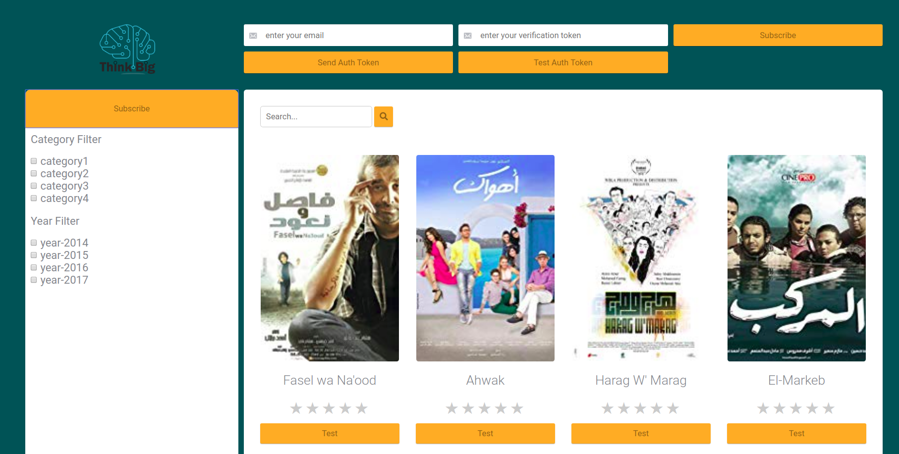
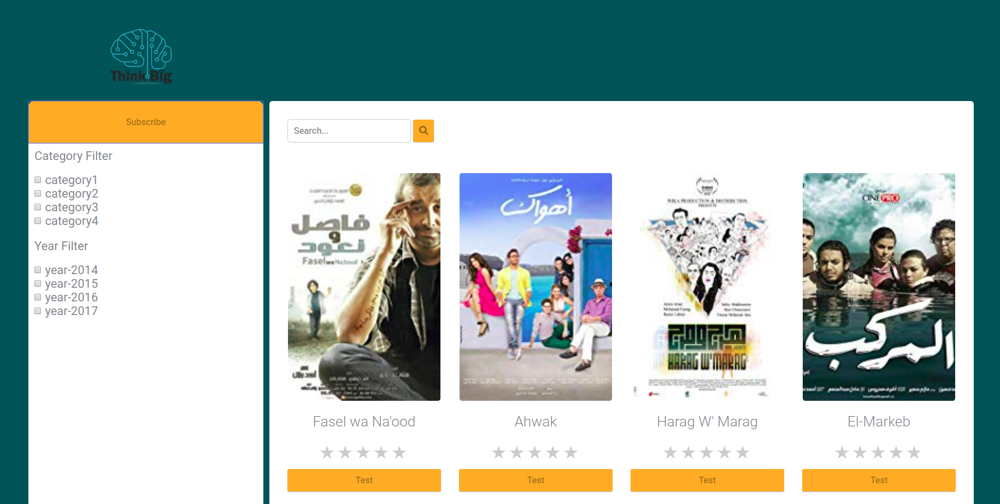
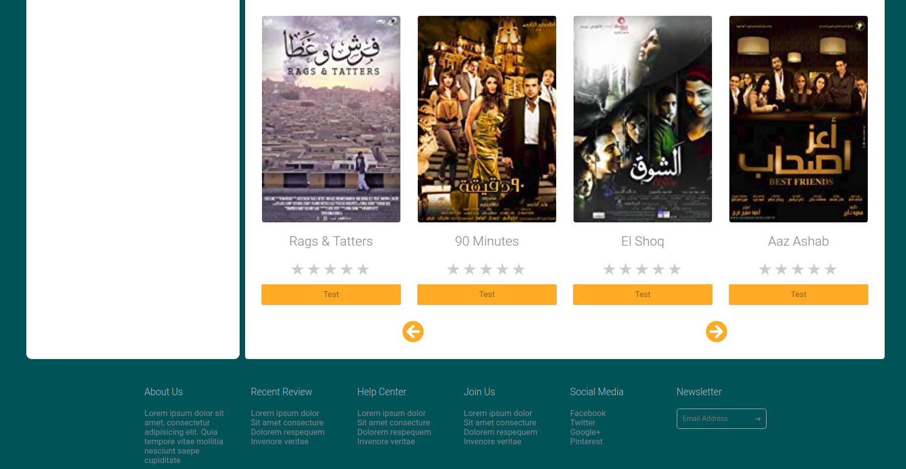

# Movie Recommendations Fe Assignment
This repository contains an assignment for ThinkBi summer interns'19.

# Fixes
<ul>
  <li>Fixing movie title text overflow.</li>
  <li>Adding css grid layout and almost removing all floats and bootstrap layouting classes.</li>
  <li>Adding aside section for filters, also it contains a subscription button that show/hide the header controls which is hidden by default when page first loading.</li>
  <li>Adding previous and next controls at the movies section buttom</li>
 </ul>
 
 

